<style>
:root {
  --slidev-theme-primary: #377fbc;
  --slidev-theme-secondary: #ff43b8;
}

h1, h2, h3, h4, h5, h6 {
  color: #163767 !important;
  font-weight: 700;
}

strong {
  color: #ff43b8;
  font-weight: 600;
}

em {
  color: #377fbc;
  font-style: italic;
}

table {
  border-collapse: collapse;
  width: 100%;
  margin: 1rem 0;
  background: #f8f9fa;
  border-radius: 8px;
  overflow: hidden;
}

table th {
  background: #377fbc;
  color: #e9e9e9;
  padding: 12px;
  text-align: left;
  border-bottom: 2px solid #ff43b8;
  font-weight: 700;
}

table td {
  padding: 10px 12px;
  border-bottom: 1px solid #e0e7ff;
  color: #051832;
}

table tr:hover {
  background: rgba(55, 127, 188, 0.08);
}

.slidev-content blockquote, .slidev-layout blockquote, blockquote {
  border-left: 10px solid #ff43b8 !important;
  background: #f0f4f8 !important;
  margin-top: 1em !important;
  margin-bottom: 1em !important;
  padding: 1em !important;
  border-radius: 4px !important;
  color: #163767 !important;
}

.small-code pre {
  font-size: 0.82em;
}
</style>

# Linked Lists

TI202 - Data Structures and Programming 1

**Rado Rakotonarivo**  

---

# Course Outline

<div grid="~ cols-2 gap-4">

<v-clicks>

<div>

1. **Review: Data Structures**
   - Role and importance
   - Limitations of arrays

2. **Building a Linked List**
   - From cell to list
   - Implementation in C

</div>

<div>

3. **Essential Operations on Linked Lists**
   - Creating, inserting, deleting cells
   - List traversal
   - Memory deallocation

4. **Choosing and Programming Correctly**
   - Comparison with arrays
   - When to use an SLL?
   - Best practices

</div>

</v-clicks>

</div>

---
layout: intro
---

# Review: Data Structures

---

## Role and Importance

A *data structure* is used to:

<v-clicks>

- Organise information in memory
- Make certain operations on that information easier
- Reduce the time or memory cost of a program

</v-clicks>

<v-clicks>

> - The same problem can become easy or hard depending on the chosen structure.
> - A data structure is suited to an algorithm (a particular use), and conversely, an algorithm is designed for a given data structure.

</v-clicks>

<v-clicks>

## Example

- Binary search requires a *sorted* (ordered according to some criterion) data structure to be efficient.
- Data structures (other than sorted arrays) have been designed to allow fast searches by guaranteeing a *partial order* among elements (e.g. binary search trees, hash tables, etc.).

</v-clicks>

---

# Why Does It Matter?

<v-clicks>

> The choice of a data structure mainly depends on the operations performed most frequently.

</v-clicks>

<v-clicks>

- **Search engine**: store and retrieve web pages quickly
  - *Frequent operations*: inserting new pages, searching by keyword
- **Messaging**: dynamically manage contacts and messages
  - *Frequent operations*: adding/removing contacts, sending/receiving messages
- **Queue**: add and remove elements one by one
  - *Frequent operations*: insertion at one end, removal from the other

</v-clicks>

---

# Limitations of Arrays

<v-clicks>

In an array, elements are stored contiguously in memory.

```plaintext
 ┌─────┬─────┬─────┬───────┬───────┐
 │ [0] │ [1] │ [2] │  ...  │ [n-1] │
 └─────┴─────┴─────┴───────┴───────┘
   @80   @84   @88    ...    @80+4(n-1)
```

</v-clicks>

<v-clicks>

### Drawbacks

- **Fixed size**: space must be reserved in advance (even with dynamic allocation)
- **Costly resizing**: elements often need to be copied
- **Costly insertion/deletion**: elements must be shifted
- **Possible waste**: sometimes more space than needed is reserved

</v-clicks>

---

## Insertion Cost Example

To insert `25` into the following array while maintaining ascending order.

```plaintext
 ┌────┬────┬────┬────┬────┐
 │ 10 │ 20 │ 30 │ 40 │ 50 │
 └────┴────┴────┴────┴────┘
   0    1    2    3    4
```

<v-clicks>

We would need to:

- Find the insertion position (here, between `20` and `30`)
- Possibly resize the array if capacity is reached (❌ *costly*)
- Shift `30`, `40` and `50` to the right (❌ *costly*)
- The larger the array, the more expensive this operation

</v-clicks>

<v-clicks>

> - **Keep in mind that it is not always possible to be optimal for all operations: trade-offs must be made**.
> - The idea is therefore to use a **dynamic** structure that grows and shrinks as needed without requiring elements to be moved.

</v-clicks>

---
layout: intro
---

# Building a Linked List

---

## What is a Linked List?

A *linked list* (or singly linked list or SLL) is a sequence of cells.

<v-clicks>

- Each cell contains a **value** (the useful data)
- Each cell contains the **address of the next cell** in the list
- The last cell is identified by the fact that the next address is `NULL`

</v-clicks>

<v-clicks>

> A linked list represents a collection of elements without requiring all cells to be side by side in memory.

## How to represent it?

A cell is a data structure that contains:
- a value (e.g. an integer)
- a pointer to the next cell

> In C, it is a structured type containing **two fields**

</v-clicks>

---

# Array vs Linked List (Memory Representation)

<div grid="~ cols-2 gap-8">

<div>

## Array

```plaintext
 ┌────┬────┬────┐
 │ 10 │ 20 │ 30 │
 └────┴────┴────┘
  @80  @84  @88 
```

- Elements are side by side in memory
- Direct access by index

> Identified in memory by the address of the first element

</div>

<div>

## Linked List

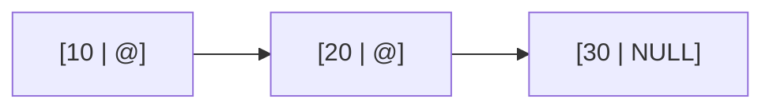
- Cells are scattered in memory
- Navigation via pointers

> Identified in memory by the address of the first cell (*head* of the list)

</div>

</div>

---

# Implementation in C

<div grid="~ cols-2 gap-4">

<v-clicks>

<div>

## The `t_cell` type

```c
typedef struct s_cell {
    int value;           // useful value (e.g. an integer)
    struct s_cell *next; // address of the next cell
} t_cell;
```

</div>

<div>

## The `t_list` type

```c
typedef t_cell* t_list; // pointer to the list head
t_list l = NULL; // empty list initialisation
```

</div>

</v-clicks>

</div>

<v-clicks>

> Note that the `next` field is of type `struct s_cell *` because the type `t_cell` is not yet fully defined at that point.

## Example

A list of type `t_list` containing cells with values `10`, `20` and `30` could be represented in memory as follows:

```plaintext
l [@104] --> [10 | @80] --> [20 | @112] --> [30 | NULL]
  @256       @104           @80             @112
```

> This representation will be used in tutorials and assessments to illustrate operations on linked lists.

</v-clicks>

---
layout: intro
---

# Essential Operations

---

## Creating a Cell

<v-clicks>

**Principle**
1. Allocate memory for a new cell
2. Initialise the cell's value
3. Initialise the `next` pointer to `NULL`

**Implementation**
```c
t_cell* c = (t_cell*) malloc(sizeof(t_cell));
c->value = 42; // or any desired value
c->next = NULL;
```

**Memory representation**
```plaintext
c [@120] --> [42 | NULL]
  @256       @120
```

Here `c` is a variable stored on the stack while the cell itself is allocated on the heap at address `@120`.

</v-clicks>

---

# Creating an Empty List

> An empty list is a list that contains no cells.

To create an empty list, simply initialise the head pointer to `NULL`.
```c
t_list l = NULL;
```

---

# Insertion (of a cell) at the Head

<v-clicks>

## Principle

1. Create a new cell
2. Make this cell point to the old head
3. Update the list so that the new head is this cell


## Visualisation

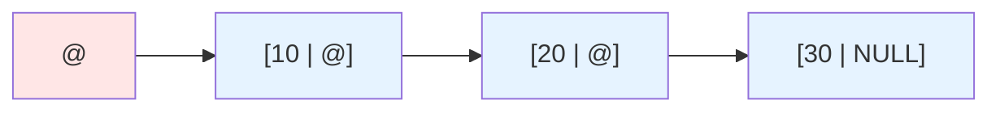

</v-clicks>

---

# Head Insertion


## Principle

1. **Create a new cell**
2. Make this cell point to the old head
3. Update the list so that the new head is this cell


## Visualisation

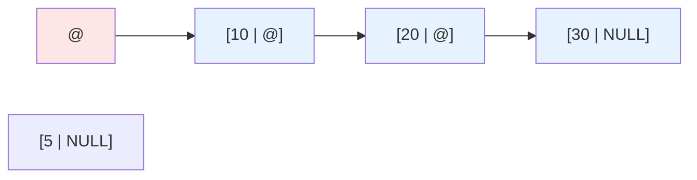

---

# Head Insertion

## Principle

1. Create a new cell
2. **Make this cell point to the old head**
3. Update the list so that the new head is this cell


## Visualisation

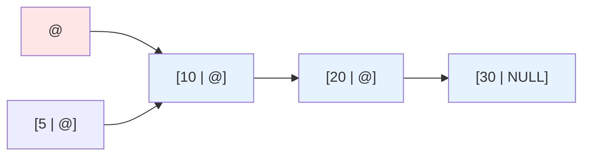

---

# Head Insertion

## Principle

1. Create a new cell
2. Make this cell point to the old head
3. **Update the list so that the new head is this cell**

## Visualisation

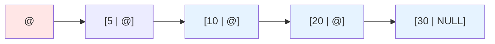

---

# Head Insertion

## Implementation

```c
// Create a new cell
t_cell *new_cell = (t_cell*) malloc(sizeof(t_cell));
new_cell->value = 5; // initialise the value
new_cell->next = NULL;   // initialise the next pointer

// Make the new cell point to the old head
new_cell->next = l;

// Update the list so the new head is this cell
l = new_cell;
```

---

# List Traversal

<v-clicks>

## Principle

1. Initialise a cursor on the list head
2. While the cursor is not `NULL`
3. Process the current cell
4. Advance the cursor to the next cell

## Visualisation

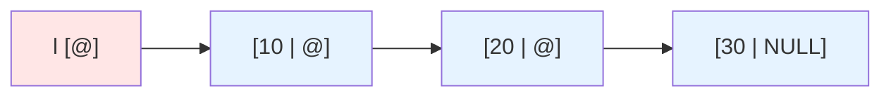

</v-clicks>

---

# List Traversal

## Principle

1. **Initialise a cursor on the list head**
2. While the cursor is not `NULL`
3. Process the current cell
4. Advance the cursor to the next cell

## Visualisation

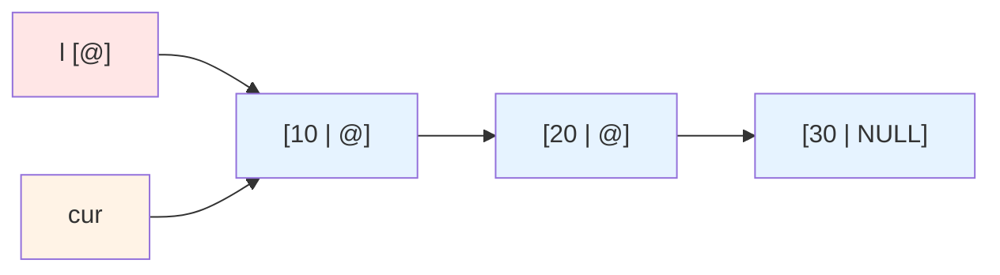

---

# List Traversal

## Principle

1. Initialise a cursor on the list head
2. **While the cursor is not `NULL`**
3. **Process the current cell**
4. Advance the cursor to the next cell

## Visualisation

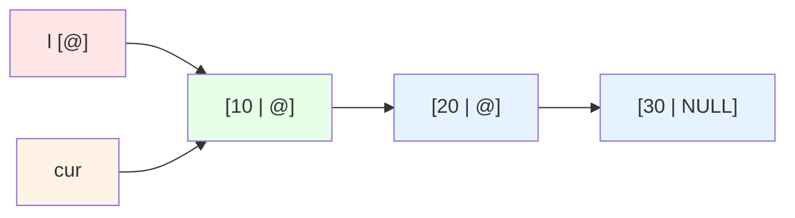

---

# List Traversal

## Principle

1. Initialise a cursor on the list head
2. While the cursor is not `NULL`
3. Process the current cell
4. **Advance the cursor to the next cell**

## Visualisation

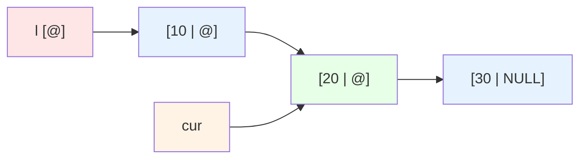

*(Repeat steps 2, 3, 4 until `cur` is `NULL`)*

---

# List Traversal

## Implementation

```c
t_cell *cur = l;
while (cur != NULL) {
    // process cur->value
    cur = cur->next;
}
```

---

# Tail Insertion

<v-clicks>

## Principle

1. Create a new cell
2. If the list is empty, the new cell becomes the head
3. Otherwise, traverse the list to the last cell
4. Link the last cell to the new one

## Visualisation


</v-clicks>

---

# Tail Insertion

## Principle

1. **Create a new cell**
2. If the list is empty, the new cell becomes the head
3. Otherwise, traverse the list to the last cell
4. Link the last cell to the new one

## Visualisation

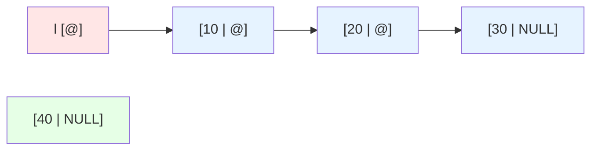

---

# Tail Insertion

## Principle

1. Create a new cell
2. If the list is empty, the new cell becomes the head
3. **Otherwise, traverse the list to the last cell**
4. Link the last cell to the new one

## Visualisation

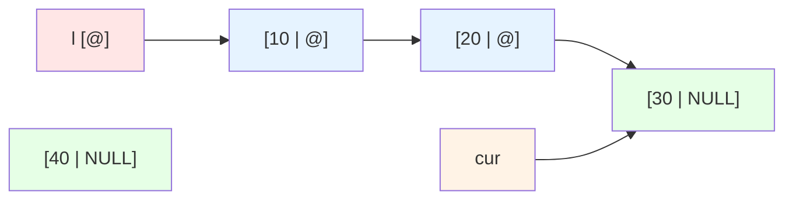

---

# Tail Insertion

## Principle

1. Create a new cell
2. If the list is empty, the new cell becomes the head
3. Otherwise, traverse the list to the last cell
4. **Link the last cell to the new one**

## Visualisation

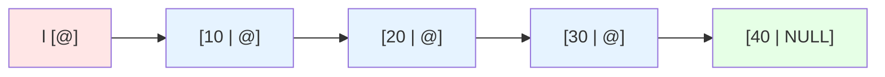

> **Linking** means making the new cell the successor of the current last cell, i.e. `cur->next = new_cell`.

---

# Tail Insertion

## Implementation

```c
t_cell *new_cell = (t_cell*) malloc(sizeof(t_cell));
new_cell->value = 40;
new_cell->next = NULL;

if (l == NULL) {
    l = new_cell;
} else {
    t_cell *cur = l;
    while (cur->next != NULL) {
        cur = cur->next;
    }
    cur->next = new_cell;
}
```

---

# Cell Deletion

<v-clicks>

## Principle

1. If the list is empty, do nothing
2. If the cell to delete is at the head, update the head and free it
3. Otherwise, traverse with `prev` and `cur` to the target
4. Relink the cells and free the memory

## Visualisation


*Goal: delete the cell with value `20`*

</v-clicks>

---

# Cell Deletion

## Principle

1. If the list is empty, do nothing
2. If the cell to delete is at the head, update the head and free it
3. **Otherwise, traverse with `prev` and `cur` to the target**
4. Relink the cells and free the memory

## Visualisation

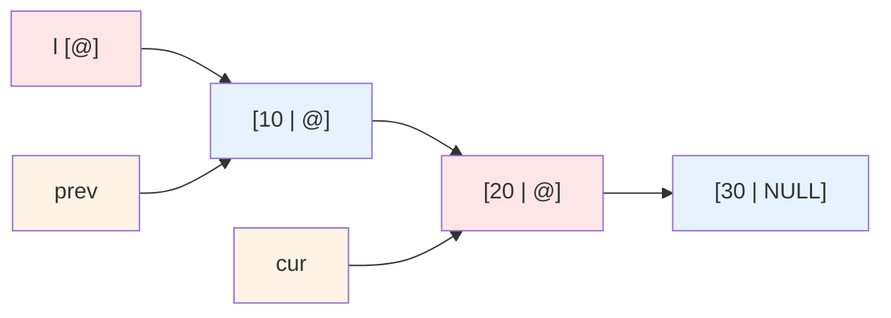

---

# Cell Deletion

## Principle

1. If the list is empty, do nothing
2. If the cell to delete is at the head, update the head and free it
3. Otherwise, traverse with `prev` and `cur` to the target
4. **Relink the cells and free the memory**

## Visualisation

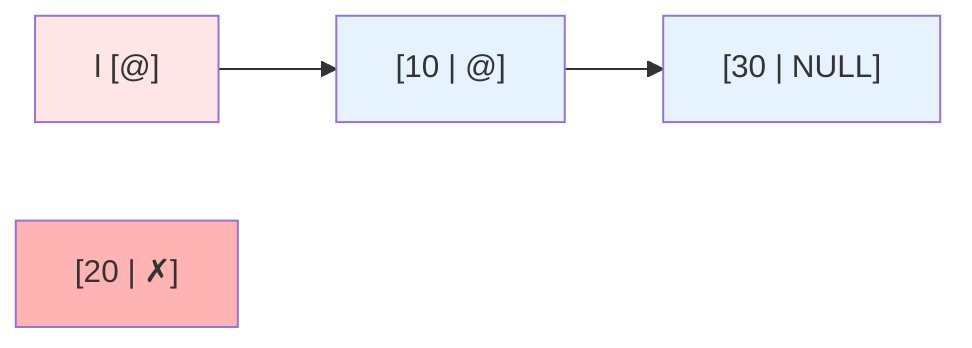

*`prev->next = cur->next` then `free(cur)`*

---

# Cell Deletion

## Implementation

```c
if (l == NULL) return;

if (l->value == value) {
    t_cell *temp = l;
    l = l->next;
    free(temp);
} else {
    t_cell *prev = NULL;
    t_cell *cur = l;
    while (cur != NULL && cur->value != value) {
        prev = cur;
        cur = cur->next;
    }
    if (cur != NULL) {
        prev->next = cur->next;
        free(cur);
    }
}
```

---

# Full List Deallocation

<v-clicks>

## Principle

1. Initialise a cursor on the list head
2. Save the pointer to the next cell
3. Free the current cell
4. Advance the cursor
5. Set the list to `NULL` once all cells are freed

## Visualisation


</v-clicks>

---

# Full List Deallocation

## Principle

1. **Initialise a cursor on the list head**
2. Save the pointer to the next cell
3. Free the current cell
4. Advance the cursor
5. Set the list to `NULL` once all cells are freed

## Visualisation


---

# Full List Deallocation

## Principle

1. Initialise a cursor on the list head
2. **Save the pointer to the next cell**
3. **Free the current cell**
4. Advance the cursor
5. Set the list to `NULL` once all cells are freed

## Visualisation

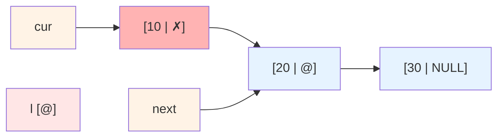

*`next = cur->next` then `free(cur)` — in this order, mandatory*

---

# Full List Deallocation

## Principle

1. Initialise a cursor on the list head
2. Save the pointer to the next cell
3. Free the current cell
4. **Advance the cursor**
5. Set the list to `NULL` once all cells are freed

## Visualisation

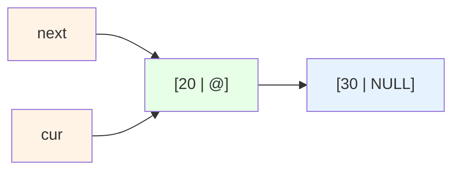

*(Repeat steps 2, 3, 4 until `cur` is `NULL`)*

---

# Full List Deallocation

## Implementation

```c
t_cell *cur = l;
t_cell *next;

while (cur != NULL) {
    next = cur->next;
    free(cur);
    cur = next;
}

l = NULL;
```

---
layout: intro
---

# Choosing and Programming Correctly

---

# SLL vs Arrays

| Criterion | Array | SLL |
|-----------|-------|-----|
| Access to an element | Direct by index | Traversal required |
| Head insertion | Shift | Very simple |
| Tail insertion | Simple if space available | Traversal to the end |
| Deletion | Shift | Relinking pointers |
| Size | Fixed or costly resizing | Dynamic |
| Memory | Contiguous | Scattered |

---

# When to Use an SLL?

<v-clicks>

- When the structure's size changes frequently
- When insertions or deletions at the head are frequent
- When direct access by index is not essential

</v-clicks>

<v-clicks>

> A linked list is not "better" than an array in general. It is better for certain specific needs.

</v-clicks>

---

# Best Practices

<v-clicks>

- Always check that a pointer is not `NULL` before dereferencing it
- Always pair each useful `malloc` with a `free` at the right time
- Use explicit names: `cur`, `prev`, `next`
- Draw the cells and pointers before writing a complex operation
- Test edge cases: empty list, single cell, head deletion, last cell deletion

</v-clicks>

---
layout: intro
---

# Recap

---

# Key Takeaways

<v-clicks>

- A linked list is a **dynamic** data structure made up of a sequence of cells linked by pointers
- A list is represented in memory by the address of its head (first cell)
- Cells are not necessarily contiguous in memory, unlike arrays
- The memory occupied by a list corresponds to the space needed to store the currently present cells, with no need for resizing
- It makes certain insertions and deletions more efficient (e.g. at the head) than arrays
- It makes direct access to a specific element harder (requires a cursor for traversal)
- **Always draw diagrams to visualise operations on linked lists and avoid pointer manipulation errors!**

</v-clicks>


