<style>
:root {
  --slidev-theme-primary: #377fbc;
  --slidev-theme-secondary: #ff43b8;
}

h1, h2, h3, h4, h5, h6 {
  color: #163767 !important;
  font-weight: 700;
}

strong {
  color: #ff43b8;
  font-weight: 600;
}

em {
  color: #377fbc;
  font-style: italic;
}

table {
  border-collapse: collapse;
  width: 100%;
  margin: 1rem 0;
  background: #f8f9fa;
  border-radius: 8px;
  overflow: hidden;
}

table th {
  background: #377fbc;
  color: #e9e9e9;
  padding: 12px;
  text-align: left;
  border-bottom: 2px solid #ff43b8;
  font-weight: 700;
}

table td {
  padding: 10px 12px;
  border-bottom: 1px solid #e0e7ff;
  color: #051832;
}

table tr:hover {
  background: rgba(55, 127, 188, 0.08);
}

.slidev-content blockquote, .slidev-layout blockquote, blockquote {
  border-left: 10px solid #ff43b8 !important;
  background: #f0f4f8 !important;
  margin-top: 1em !important;
  margin-bottom: 1em !important;
  padding: 1em !important;
  border-radius: 4px !important;
  color: #163767 !important;
}

.small-code pre {
  font-size: 0.82em;
}
</style>

# Listes chaînées

TI202 - Structure de données et Programmation 1

**Rado Rakotonarivo**  

---

# Plan du cours

<div grid="~ cols-2 gap-4">

<v-clicks>

<div>

1. **Rappels sur les structures de données**
   - Rôle et importance
   - Limites des tableaux

2. **Construire une liste chaînée**
   - De la cellule à la liste
   - Implémentation en C

</div>

<div>

3. **Opérations essentielles sur les listes chaînées**
   - Création, insertion, suppression de cellules
   - Parcours d'une liste
   - Libération mémoire

4. **Choisir et programmer correctement**
   - Comparaison avec les tableaux
   - Quand utiliser une LLC ?
   - Bonnes pratiques

</div>

</v-clicks>

</div>

---
layout: intro
---

# Rappels sur les structures de données ?

---

## Rôle et importance

Une *structure de données* sert à :

<v-clicks>

- Organiser des informations en mémoire
- Faciliter certaines opérations sur ces informations
- Réduire le coût en temps ou en mémoire d'un programme

</v-clicks>

<v-clicks>

> - Le même problème peut devenir simple ou difficile selon la structure choisie.
> - Une structure de donnée est adaptée à un algorithme (un usage particulier), et inversement, un algorithme est pensé pour une structure de données donnée.

</v-clicks>

<v-clicks>

## Exemple

- La recherche dicothomique nécessite une structure de données *triée* (ordonnée selon un critère) pour être efficace.
- Des structures de données (autres que les tableaux triées) ont été conçues pour permettre des recheches rapides en garantissant un *ordre partiel* parmis les éléments (ex : arbres binaires de recherche, tables de hachage, etc).

</v-clicks>


---

# Pourquoi est-ce important ?

<v-clicks>

> Le choix d'une structure de données dépend surtout des opérations que l'on effectue le plus souvent.

</v-clicks>

<v-clicks>

- **Moteur de recherche** : stocker et retrouver rapidement des pages web
  - *Opérations fréquentes* : insertion de nouvelles pages, recherche par mot-clé
- **Messagerie** : gérer dynamiquement des contacts et des messages
  - *Opérations fréquentes* : ajout/suppression de contacts, envoi/réception de messages
- **File d'attente** : ajouter et retirer des éléments au fur et à mesure
  - *Opérations fréquentes* : insertion en un bout, suppression de l'autre bout

</v-clicks>

---

# Limites des tableaux

<v-clicks>

Dans un tableau, les éléments sont stockés de manière contiguë en mémoire.

```plaintext
 ┌─────┬─────┬─────┬───────┬───────┐
 │ [0] │ [1] │ [2] │  ...  │ [n-1] │
 └─────┴─────┴─────┴───────┴───────┘
   @80   @84   @88    ...    @80+4(n-1)
```

</v-clicks>

<v-clicks>

### Inconvénients

- **Taille fixe** : il faut prévoir la place à l'avance (même avec l'allocation dynamique)
- **Redimensionnement coûteux** : souvent, il faut recopier les éléments
- **Insertion/suppression coûteuse** : il faut décaler des cases
- **Gaspillage possible** : on réserve parfois plus de place que nécessaire

</v-clicks>

---

## Exemple de coût d'insertion

Pour insérer `25` dans le tableau suivant de telle sorte à maintenir l'ordre croissant.

```plaintext
 ┌────┬────┬────┬────┬────┐
 │ 10 │ 20 │ 30 │ 40 │ 50 │
 └────┴────┴────┴────┴────┘
   0    1    2    3    4
```

<v-clicks>

Il faudrait :

- Trouver la position d'insertion (ici, entre `20` et `30`)
- Éventuellement redimensionner le tableau si la capacité est atteinte (❌ *coûteux*)
- `30`, `40` et `50` doivent être décalés vers la droite (❌ *coûteux*)
- Plus le tableau est grand, plus cette opération est coûteuse

</v-clicks>

<v-clicks>

> - **Il faut garder en tête qu'on ne pourra pas nécessairement être optimisé pour toutes les opérations : il s'agit de faire des compromis**.
> - L'idée est donc d'utiliser une structure **dynamique**, qui grandit et rétrécit selon les besoins sans nécessiter de déplacer les éléments.

</v-clicks>

---
layout: intro
---

# Construire une liste chaînée

---

## Qu'est-ce qu'une liste chaînée ?

Une *liste chaînée* (ou liste linéaire chaînée ou LLC) est une séquence de cellule.

<v-clicks>

- Chaque cellule contient une **valeur** (la donnée utile)
- Chaque cellule contient l'**adresse de la cellule suivante** dans la liste
- La dérnière cellule est identifiée par le fait que l'adresse suivante est `NULL`

</v-clicks>

<v-clicks>

> Une liste chaînée représente une collection d'éléments sans exiger que toutes les cases soient côte à côte en mémoire.

## Comment la représenter ?

Une cellule est une structure de données qui contient :
- une valeur (ex : un entier)
- un pointeur vers la cellule suivante

> En C, il s'agit d'un type structuré qui contient **deux champs**

</v-clicks>

---

# Tableau vs Liste chaînée (Représentation mémoire)

<div grid="~ cols-2 gap-8">

<div>

## Tableau

```plaintext
 ┌────┬────┬────┐
 │ 10 │ 20 │ 30 │
 └────┴────┴────┘
  @80  @84  @88 
```

- Les éléments sont côte à côte en mémoire
- Accès direct par indice

> Identifié en mémoire par l'adresse du premier élément 

</div>

<div>

## Liste chaînée

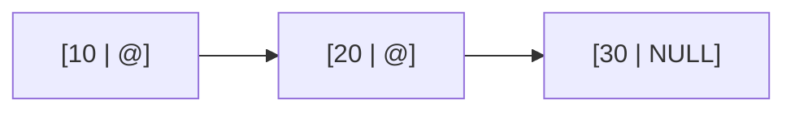
- Les cellules sont dispersées en mémoire
- Navigation par pointeurs

> Identifié en mémoire par l'adresse de la première cellule (*tête* de la liste)

</div>

</div>

---

# Implémentation en C

<div grid="~ cols-2 gap-4">

<v-clicks>

<div>

## Le type `t_cell`

```c
typedef struct s_cell {
    int value;           // valeur utile (ex : un entier)
    struct s_cell *next; // adresse de la cellule suivante
} t_cell;
```

</div>

<div>

## Le type `t_list`

```c
typedef t_cell* t_list; // pointeur vers la tête de liste
t_list l = NULL; // initialisation d'une liste vide
```

</div>

</v-clicks>

</div>

<v-clicks>

> Notez le champ `next` est de type `struct s_cell *` car le type `t_cell` n'est pas encore complètement défini à ce stade.

## Exemple

Une liste de type `t_list` contenant des cellules avec les valeurs `10`, `20` et `30` pourrait être représentée en mémoire comme suit :

```plaintext
l [@104] --> [10 | @80] --> [20 | @112] --> [30 | NULL]
  @256       @104           @80             @112
```

> Cette représentation sera utilisée en TD et lors des évaluations pour illustrer les opérations sur les listes chaînées.

</v-clicks>

---
layout: intro
---

# Opérations essentielles

---

## Créer une cellule

<v-clicks>

**Principe**
1. Allouer de la mémoire pour une nouvelle cellule
2. Initialiser la valeur de la cellule
3. Initialiser le pointeur `next` à `NULL`

**Implémentation**
```c
t_cell* c = (t_cell*) malloc(sizeof(t_cell));
c->value = 42; // ou toute autre valeur souhaitée
c->next = NULL;
```

**Représention en mémoire**
```plaintext
c [@120] --> [42 | NULL]
  @256       @120
```

Ici `c` est une variable stockée dans la pile tandis que la cellule elle-même est allouée dans le tas (heap) à l'adresse `@120`.

</v-clicks>

---

# Créer une liste vide

> Une liste vide est une liste qui ne contient aucune cellule.

Afin de créer une liste vide, il suffit d'initialiser le pointeur de tête à `NULL`.
```c
t_list l = NULL;
```

---

# Insertion (d'une cellule) en tête

<v-clicks>

## Principe

1. Créer un nouvelle cellule
2. Faire pointer cette cellule vers l'ancienne tête
3. Mettre à jour la liste pour que la nouvelle tête soit cette cellule


## Visualisation

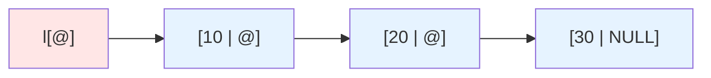

</v-clicks>

---

# Insertion en tête


## Principe

1. **Créer un nouvelle cellule**
2. Faire pointer cette cellule vers l'ancienne tête
3. Mettre à jour la liste pour que la nouvelle tête soit cette cellule


## Visualisation

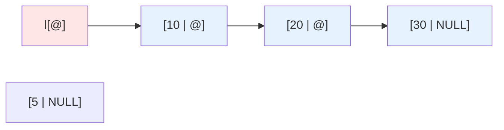

---

# Insertion en tête

## Principe

1. Créer un nouvelle cellule
2. **Faire pointer cette cellule vers l'ancienne tête**
3. Mettre à jour la liste pour que la nouvelle tête soit cette cellule


## Visualisation

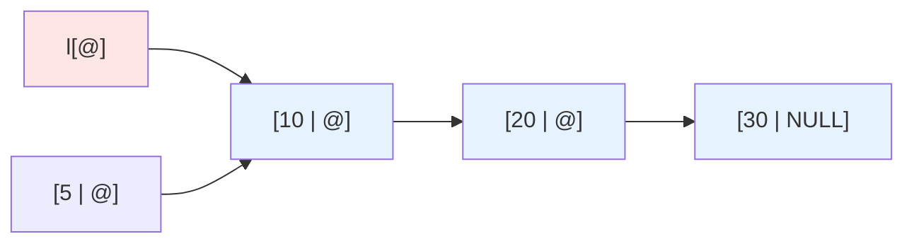

---

# Insertion en tête

## Principe

1. Créer un nouvelle cellule
2. Faire pointer cette cellule vers l'ancienne tête
3. **Mettre à jour la liste pour que la nouvelle tête soit cette cellule**

## Visualisation

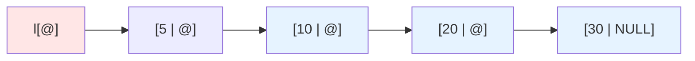

---

# Insertion en tête

## Implémentation

```c
// Création d'une nouvelle cellule
t_cell *new_cell = (t_cell*) malloc(sizeof(t_cell));
new_cell->value = 5; // initialisation de la valeur
new_cell->next = NULL;   // initialisation du pointeur next

// Faire pointer la nouvelle cellule vers l'ancienne tête
new_cell->next = l;

// Mettre à jour la liste pour que la nouvelle tête soit cette cellule
l = new_cell;
```

> **Questions** :
> - Est-ce que ces étapes peuvent être faites dans un ordre différent ?
> - Est-ce que cette opération fonctionne si la liste est initialement vide (`l == NULL`) ?

---

# Parcours d'une liste

<v-clicks>

## Principe

1. Initialiser un curseur sur la tête de la liste
2. Tant que le curseur n'est pas `NULL`
3. Traiter la cellule courante
4. Avancer le curseur vers la cellule suivante

## Visualisation

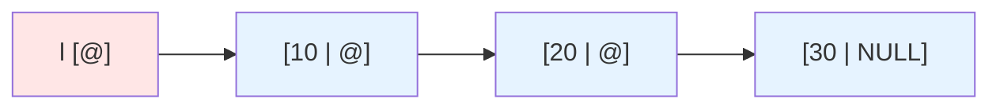

</v-clicks>

---

# Parcours d'une liste

## Principe

1. **Initialiser un curseur sur la tête de la liste**
2. Tant que le curseur n'est pas `NULL`
3. Traiter la cellule courante
4. Avancer le curseur vers la cellule suivante

## Visualisation

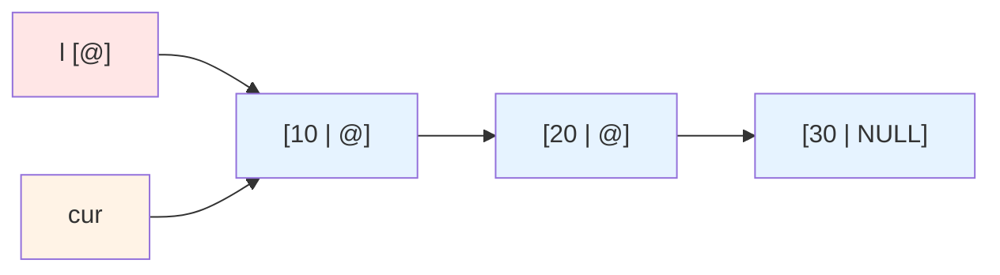

---

# Parcours d'une liste

## Principe

1. Initialiser un curseur sur la tête de la liste
2. **Tant que le curseur n'est pas `NULL`**
3. **Traiter la cellule courante**
4. Avancer le curseur vers la cellule suivante

## Visualisation

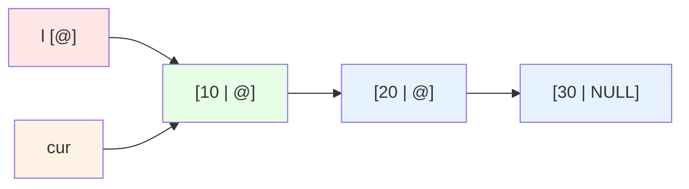

---

# Parcours d'une liste

## Principe

1. Initialiser un curseur sur la tête de la liste
2. Tant que le curseur n'est pas `NULL`
3. Traiter la cellule courante
4. **Avancer le curseur vers la cellule suivante**

## Visualisation

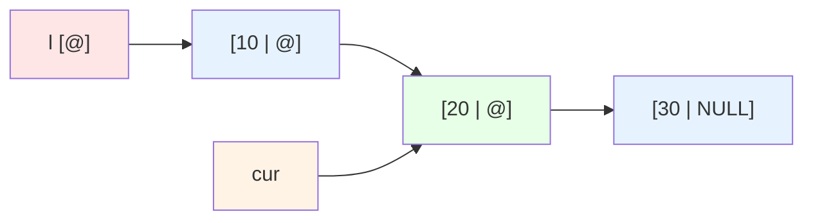

*(Répéter les étapes 2, 3, 4 jusqu'à ce que `cur` soit `NULL`)*

---

# Parcours d'une liste

## Implémentation

```c
t_cell *cur = l;
while (cur != NULL) {
    // traitement de cur->value
    cur = cur->next;
}
```

---

# Insertion en fin

<v-clicks>

## Principe

1. Créer un nouvelle cellule
2. Si la liste est vide, la nouvelle cellule devient la tête
3. Sinon, parcourir la liste jusqu'à la dernière cellule
4. Chaîner la dernière cellule à la nouvelle

## Visualisation


</v-clicks>

---

# Insertion en fin

## Principe

1. **Créer un nouvelle cellule**
2. Si la liste est vide, la nouvelle cellule devient la tête
3. Sinon, parcourir la liste jusqu'à la dernière cellule
4. Chaîner la dernière cellule à la nouvelle

## Visualisation

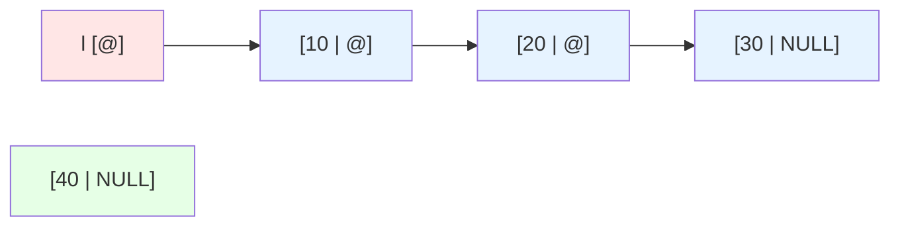

---

# Insertion en fin

## Principe

1. Créer un nouvelle cellule
2. Si la liste est vide, la nouvelle cellule devient la tête
3. **Sinon, parcourir la liste jusqu'à la dernière cellule**
4. Chaîner la dernière cellule à la nouvelle

## Visualisation

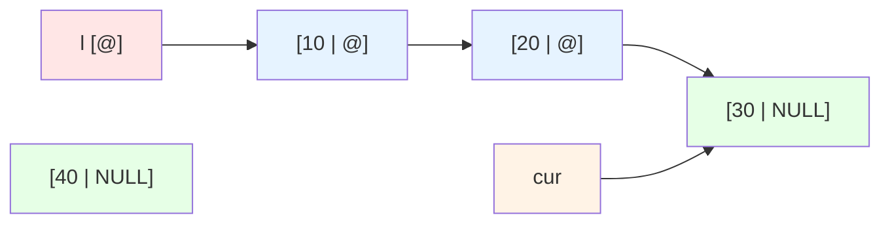

---

# Insertion en fin

## Principe

1. Créer un nouvelle cellule
2. Si la liste est vide, la nouvelle cellule devient la tête
3. Sinon, parcourir la liste jusqu'à la dernière cellule
4. **Chaîner la dernière cellule à la nouvelle**

## Visualisation

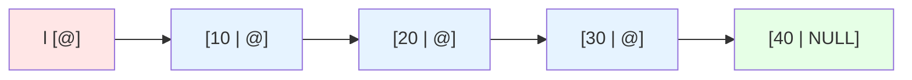

> **Chaîner** consiste à faire en sorte que la nouvelle cellule soit la suivante de la dernière cellule actuelle, c'est-à-dire `cur->next = new_cell`. 


---

# Insertion en fin

## Implémentation

```c
t_cell *new_cell = (t_cell*) malloc(sizeof(t_cell));
new_cell->value = 40;
new_cell->next = NULL;

if (l == NULL) {
    l = new_cell;
} else {
    t_cell *cur = l;
    while (cur->next != NULL) {
        cur = cur->next;
    }
    cur->next = new_cell;
}
```

---

# Suppression d'une cellule

<v-clicks>

## Principe

1. Si la liste est vide, ne rien faire
2. Si la cellule à supprimer est en tête, mettre à jour la tête et libérer
3. Sinon, parcourir avec `prev` et `cur` jusqu'à la cible
4. Réenchaîner les cellules et libérer la mémoire

## Visualisation


*Objectif : supprimer la cellule de valeur `20`*

</v-clicks>

---

# Suppression d'une cellule

## Principe

1. Si la liste est vide, ne rien faire
2. Si la cellule à supprimer est en tête, mettre à jour la tête et libérer
3. **Sinon, parcourir avec `prev` et `cur` jusqu'à la cible**
4. Réenchaîner les cellules et libérer la mémoire

## Visualisation

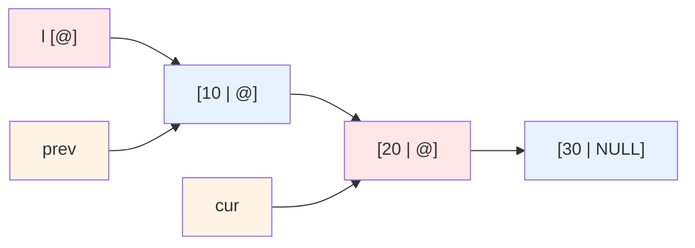

---

# Suppression d'une cellule

## Principe

1. Si la liste est vide, ne rien faire
2. Si la cellule à supprimer est en tête, mettre à jour la tête et libérer
3. Sinon, parcourir avec `prev` et `cur` jusqu'à la cible
4. **Réenchaîner les cellules et libérer la mémoire**

## Visualisation

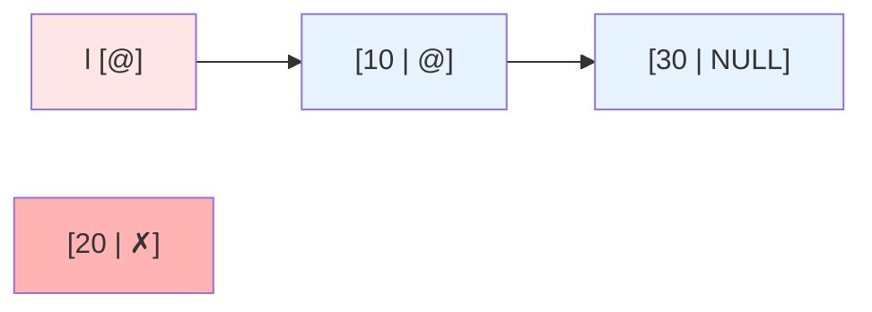

*`prev->next = cur->next` puis `free(cur)`*

---

# Suppression d'une cellule

## Implémentation

```c
if (l == NULL) return;

if (l->value == value) {
    t_cell *temp = l;
    l = l->next;
    free(temp);
} else {
    t_cell *prev = NULL;
    t_cell *cur = l;
    while (cur != NULL && cur->value != value) {
        prev = cur;
        cur = cur->next;
    }
    if (cur != NULL) {
        prev->next = cur->next;
        free(cur);
    }
}
```

---

# Libération complète de la liste

<v-clicks>

## Principe

1. Initialiser un curseur sur la tête de la liste
2. Sauvegarder le pointeur vers la cellule suivante
3. Libérer la cellule courante
4. Avancer le curseur
5. Mettre la liste à `NULL` une fois toutes les cellules libérées

## Visualisation


</v-clicks>

---

# Libération complète de la liste

## Principe

1. **Initialiser un curseur sur la tête de la liste**
2. Sauvegarder le pointeur vers la cellule suivante
3. Libérer la cellule courante
4. Avancer le curseur
5. Mettre la liste à `NULL` une fois toutes les cellules libérées

## Visualisation


---

# Libération complète de la liste

## Principe

1. Initialiser un curseur sur la tête de la liste
2. **Sauvegarder le pointeur vers la cellule suivante**
3. **Libérer la cellule courante**
4. Avancer le curseur
5. Mettre la liste à `NULL` une fois toutes les cellules libérées

## Visualisation

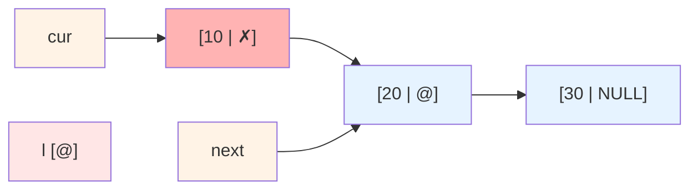

*`next = cur->next` puis `free(cur)` — dans cet ordre obligatoirement*

---

# Libération complète de la liste

## Principe

1. Initialiser un curseur sur la tête de la liste
2. Sauvegarder le pointeur vers la cellule suivante
3. Libérer la cellule courante
4. **Avancer le curseur**
5. Mettre la liste à `NULL` une fois toutes les cellules libérées

## Visualisation

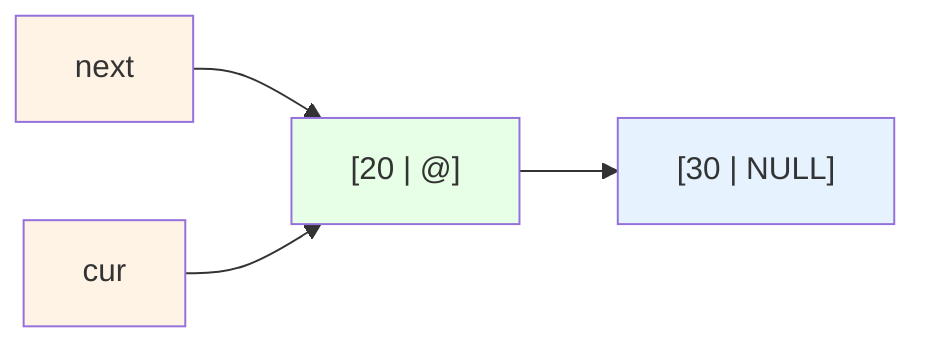

*(Répéter les étapes 2, 3, 4 jusqu'à ce que `cur` soit `NULL`)*

---

# Libération complète de la liste

## Implémentation

```c
t_cell *cur = l;
t_cell *next;

while (cur != NULL) {
    next = cur->next;
    free(cur);
    cur = next;
}

l = NULL;
```

---
layout: intro
---

# Choisir et programmer correctement

---

# LLC vs tableaux

| Critère | Tableau | LLC |
|---------|---------|-----|
| Accès à un élément | Direct par indice | Parcours nécessaire |
| Insertion en tête | Décalage | Très simple |
| Insertion en fin | Simple si place libre | Parcours jusqu'à la fin |
| Suppression | Décalage | Réenchaînement des pointeurs |
| Taille | Fixe ou redimensionnement coûteux | Dynamique |
| Mémoire | Contiguë | Dispersée |

---

# Quand utiliser une LLC ?

<v-clicks>

- Quand la taille de la structure varie souvent
- Quand on insère ou supprime souvent en tête
- Quand l'accès direct par indice n'est pas indispensable

</v-clicks>

<v-clicks>

> Une liste chaînée n'est pas "meilleure" qu'un tableau en général. Elle est meilleure pour certains besoins précis.

</v-clicks>

---

# Bonnes pratiques

<v-clicks>

- Toujours vérifier qu'un pointeur n'est pas `NULL` avant de le déréférencer
- Toujours associer un `malloc` utile à un `free` au bon moment
- Utiliser des noms explicites : `cur`, `prev`, `next`
- Dessiner les cellules et les pointeurs avant d'écrire une opération complexe
- Tester les cas limites : liste vide, une seule cellule, suppression en tête, suppression du dernier

</v-clicks>

---
layout: intro
---

# Récapitulatif

---

# À retenir

<v-clicks>

- Une liste chaînée est une structure de données **dynamique** constituée d'une séquence de cellules reliées par des pointeurs
- Une liste est représentée en mémoire par l'adresse de sa tête (première cellule)
- Les cellules ne sont pas nécessairement contiguës en mémoire, contrairement aux tableaux
- L'espace mémoire occupée par une liste correspond à l'espace nécessaire pour stocker les cellules actuellement présentes, sans besoin de redimensionnement
- Elle rend certaines insertions et suppressions plus efficaces (ex : en tête) que les tableaux
- Elle complique en revanche l'accès direct à un élément précis (nécessite un curseur pour le parcours)
- **Toujours faire des schémas pour visualiser les opérations sur les listes chaînées et éviter les erreurs de manipulation des pointeurs !**

</v-clicks>


